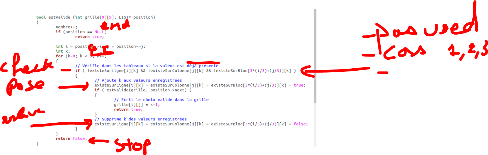
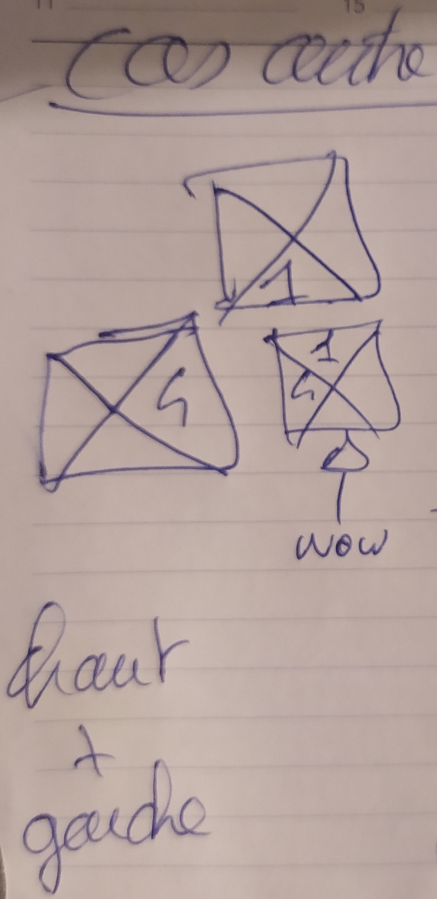
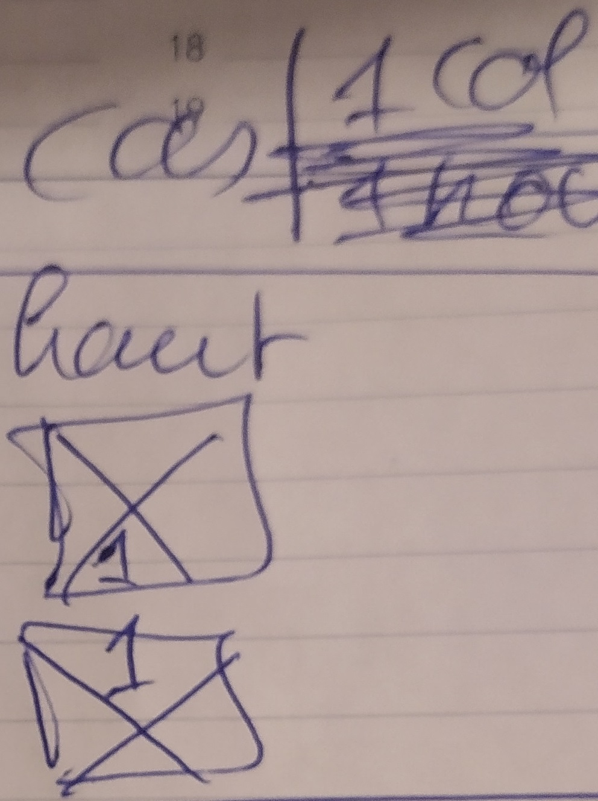
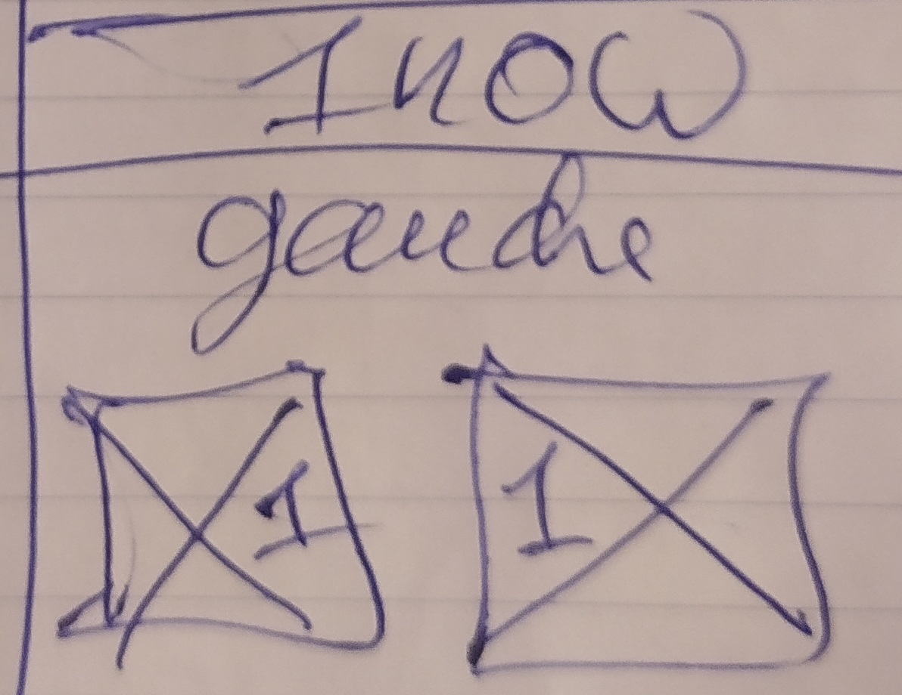

# Ideas

## Générale

- Prendre la premiere piece
- Mettre dans chaque case
- Voir la case de droite
  - Essayer de poser une des pieces
    - Tester avec chaque piece
  - Si marche pour aucune piece
    - Alors changer la premiere piece
  - Si marche
    - passer a la suivante jusqu'à bloquer et faire marche arriere quand sa bloque
- S'arreter quand full()
  - return True

### Plus précis

- **if** pos == end
  - return true
- **for** 0 -> 5*5
  - **Si** (cas1 OR cas2 OR cas3) AND notUsed(piece) Alors
    - poserPiece(coordonées)
    - recursivité(nextPosition)
      - poser la piece suivante
      - *(RECURSION ICI)*
    - **Si** la récursivité à échouer Alors
      - Retirer la piece
      - Stop la branche
  - **Sinon**
    - Stop la branche

## Récursivité

- Passer en paramètre de la fonction récursive
  - La board
  - Les coordonnées (x,y) du current empty
- Les availables cards sont elles en Global et contienent l'état d'utilisation.

## Différents cas

### Cas 1

### Cas 2

### Cas 3

# Liens utiles

- [Le sujet](https://e-uapv2020.univ-avignon.fr/pluginfile.php/68078/mod_resource/content/1/projet.pdf)
- [Le jeu](https://gamegix.com/tetravex/game?size=2)
- [Exemple Sodoku](http://www-igm.univ-mlv.fr/~dr/XPOSE2013/sudoku/backtracking.html)
- [Autre exemple de Sodoku](https://www.geeksforgeeks.org/backtracking-algorithms/)